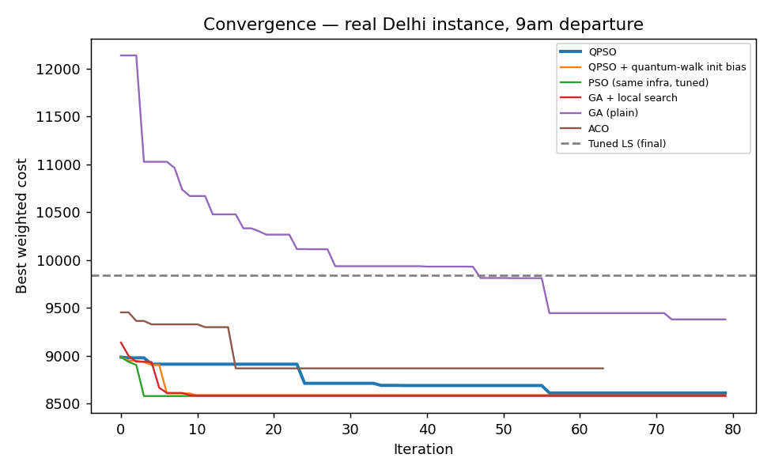
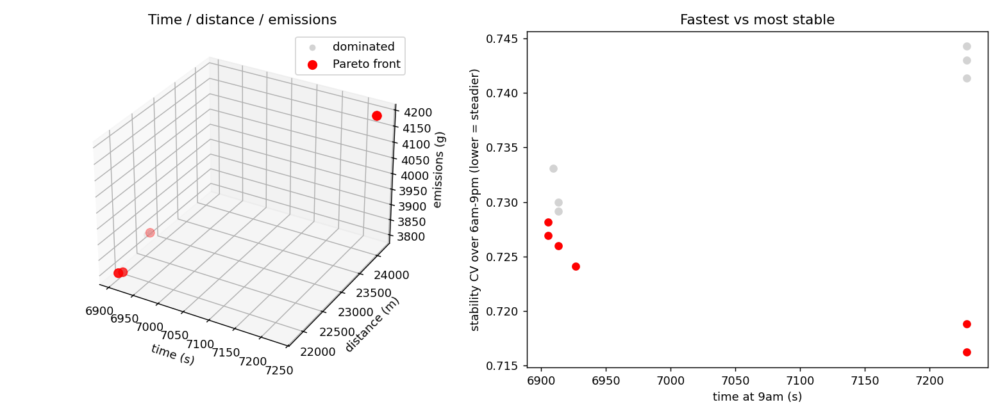
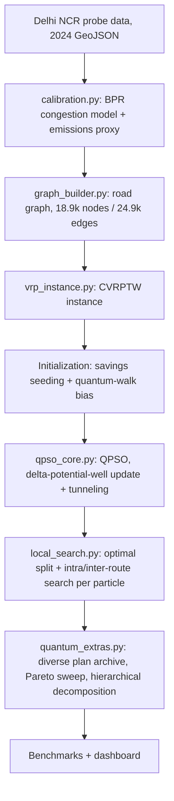

# SIH26137 — QRoute: Quantum-Inspired Intelligent Traffic Route Optimization (Delhi NCR)
**Live demo:** https://qroute.streamlit.app

A quantum-behaved particle swarm optimizer (**QPSO**) for the **Capacitated Vehicle Routing Problem with Time Windows (CVRPTW)**, driven by a real Delhi NCR road graph and 2024 hourly traffic probe data (Aug 11–30, including the Rakshabandhan festival day).

The project is built around two questions:

1. How does a QPSO-based router compare, **honestly and statistically**, against GA, ACO, local search, classical PSO, a memetic GA and Google OR-Tools?
2. What does real Delhi traffic data say about **dynamic re-routing**: festival-day shifts, departure-time effects and road-closure recovery?

> **Short version of the findings:** QPSO is far better than plain GA, ACO and tuned local search, and is within about 0.7% of OR-Tools on average. It is **statistically tied** with classical PSO and a memetic GA that use the same local search, so the quantum update rule is *not* shown to be the source of the gain. See [Results](#results) and [Limitations](#limitations).

---

## Dashboard

An interactive Streamlit dashboard presents the results in seven tabs: Overview, Live Route Map, Real-anomaly tests, Benchmarking, Convergence & Pareto, Scalability, and Honesty & protocol.

The route map is also generated as a standalone file: open [`outputs/map.html`](outputs/map.html) in a browser (QPSO plan in red, OR-Tools plan in green, on the real central-Delhi road See the route map in the **Live Route Map** tab of the [live demo](https://qroute.streamlit.app) (QPSO plan in red, OR-Tools plan in green, on the real central-Delhi road subgraph). A standalone copy is saved as `outputs/map.html`; download it and open it in a browser.

| Convergence | Pareto trade-offs |
|---|---|
|  |  |

---

## Quick Start

### Requirements

- **Python 3.11 or newer** (required by the pinned `pandas==3.0.2` and `streamlit==1.64.0`)
- Windows, macOS or Linux

### 1. View the dashboard (no dataset needed)

All results are precomputed and stored in `outputs/`.

```bash
git clone https://github.com/Gutsmaster/QRoute.git
cd QRoute

pip install streamlit==1.64.0 pandas==3.0.2 numpy
python -m streamlit run dashboard/app.py
```

Then open <http://localhost:8501>.

On macOS/Linux you can instead run `./run_dashboard.sh` (creates a virtual environment and launches the dashboard; run `chmod +x run_dashboard.sh` first if needed).

> **Important:** use `streamlit==1.64.0`. The Live Route Map tab uses `st.iframe`, which does not exist in older Streamlit versions (for example 1.51.0) and raises `AttributeError: module 'streamlit' has no attribute 'iframe'`.

### 2. Regenerate everything (needs the dataset)

1. Download the **New Delhi Traffic Probe Count & Analytics Dataset (2024)** from Kaggle (see [Dataset](#dataset)).
2. Place it so the daily GeoJSON files are at:
   ```
   data/new_delhi_traffic_dataset/probe_counts/geojson/new_delhi__<start>_to_<end>_.geojson
   ```
3. Install all dependencies and run the pipeline from the project root:

```bash
pip install -r requirements.txt
python run_everything.py     # data -> graph -> QPSO -> benchmarks -> plots (about 11 minutes)
python build_map.py          # builds outputs/map.html
```

(or `./run_full_pipeline.sh` on macOS/Linux, which does both and sets up a virtual environment.)

For a fast smoke test with tiny budgets, set `QUICK=1` (for example `QUICK=1 python run_everything.py`; on Windows PowerShell: `$env:QUICK="1"; python run_everything.py`).

> Scripts add `src/` and `benchmarks/` to the import path relative to the working directory, so **run them from the project root**.

---

## How it works



- **Traffic model:** the dataset gives relative probe counts, not absolute volumes. Each segment's saturation is taken as its probe count divided by its own 20-day maximum, used as a volume/capacity proxy, then converted to travel time with a **BPR congestion function**. Emissions use a COPERT-*inspired* proxy.
- **Encoding:** a particle is a vector of priority keys in [0,1]. Customers are sorted by key into a giant tour, then split into capacity-feasible routes with an optimal split.
- **Update rule:** delta-potential-well QPSO (mean-best attractor, contraction–expansion coefficient that decays over iterations), plus a tunneling jump.
- **Shared local search:** every particle gets local search each iteration, and the improved plan is written back into its keys. All swarm and evolutionary baselines use the same local-search stack, so comparisons isolate the search strategy.
- **Extras:** quantum-walk centrality to bias initial solutions, hierarchical (zone) decomposition for larger instances, a MAP-Elites-style archive of diverse plans for instant fallback after a disruption, and a 4-metric Pareto sweep (time, distance, emissions, stability).
- **Objective:** weighted sum of travel time, distance, emissions and number of routes, plus penalties for capacity and time-window violations.

---

## Results

Held-out benchmark: **8 instances × 4 seeds = 32 paired runs** (2 Delhi instances built from real traffic data plus 6 Solomon-style synthetic instances, about 24 customers each). Lower cost is better; "QPSO improvement" is the mean cost reduction of QPSO relative to the opponent.

| Opponent | QPSO improvement | Wilcoxon p | Reading |
|---|---:|---:|---|
| Tuned local search (NN + 2-opt, "HGS-inspired") | +33.4% | < 0.0001 | QPSO clearly better |
| Ant Colony Optimization | +43.8% | < 0.0001 | QPSO clearly better |
| Plain Genetic Algorithm | +18.3% | < 0.0001 | QPSO clearly better |
| Classical PSO (same infrastructure) | +0.5% | 0.20 | **Not significant** |
| Memetic GA (same local search) | −0.2% | 0.57 | **Statistically tied** |
| First-pass QPSO (earlier version of this project) | +57.6% | < 0.0001 | Internal progress only |
| OR-Tools CVRPTW (5 s, best of 2 configs) | mean gap +0.7% | — | Reference; QPSO is close but not better |

Per-instance numbers are in [`outputs/benchmark_table.csv`](outputs/benchmark_table.csv) and the full statistics in [`outputs/results.json`](outputs/results.json). Typical wall-clock per run: QPSO 3.5 s, memetic GA 2.1 s, OR-Tools 10.4 s (two configurations at 5 s each).

### What the real Delhi data shows

- **Festival-day shift (Rakshabandhan Aug 19 vs normal Aug 12):** a plan optimized for the normal day costs **7.2% more at 9 AM** and **9.5% more at 6 PM** than re-optimizing for the festival day.
- **Never re-routing:** a fixed 9 AM plan has a mean regret of **12.8%** across departure hours 6 AM–9 PM.
- **Road-closure fallback:** after a simulated closure, the incumbent plan costs 12,758; the best archived alternative costs **9,468 instantly**, versus 8,935 after a 4.7 s full re-optimization.

These figures come from single instances and vary with optimizer strength, so treat them as indicative ranges.

### Other findings

- **Scalability:** at 72 customers, flat QPSO reaches cost 16,003 in 12.1 s; hierarchical decomposition reaches 17,111 in 6.9 s. Hierarchical decomposition buys **speed, not quality**.
- **Disruption recovery by reverse annealing:** no measurable benefit (better in 2 of 5 seeds), so it is not claimed.
- **Quantum-update investigation:** roughly 20 alternative mechanisms were tested on the tuning set; none produced a robust improvement over the baseline QPSO. Details are in [`outputs/tuning_logs/qpso_push_investigation_notes.md`](outputs/tuning_logs/qpso_push_investigation_notes.md).

---

## Evaluation protocol

- Settings were tuned on a separate **tuning set** (one Delhi instance and Solomon-style seed-101 instances, algorithm seeds 0–3). Benchmark numbers come from different instances and seeds.
- Two shared-infrastructure changes (write-back of local-search gains into particle keys, and extended inter-route local search) were selected on the tuning set, then confirmed with pre-registered hypotheses and Holm correction on fresh seeds, and replicated on newly generated instances. These changes apply equally to QPSO and PSO.
- The held-out instances were used once for that confirmation, so the final benchmark is best read as a strong, but not pristine, held-out test.
- Everything is logged in [`outputs/tuning_logs/`](outputs/tuning_logs/).

---

## Limitations

- **Real vs synthetic:** road geometry, hourly probe counts and the festival window are real. Customer demand and time windows are **synthetic** (the dataset has no order-level data), and the benchmark instances are Solomon-*style*, not the official Solomon files.
- **Small instances:** benchmarks use about 24 customers; the scalability test goes up to 72. The map and demo run on a 455-node central-Delhi subgraph, not the full 24,938-segment network.
- **Traffic snapshot:** each run uses a single-hour traffic snapshot, not a fully time-dependent model.
- **Baselines:** the "HGS-inspired" baseline is nearest-neighbour plus 2-opt, not the real HGS-CVRP. OR-Tools is a single 5-second run per instance.
- **Statistics:** the 32 paired runs share only 8 instances, so they are not fully independent and p-values are somewhat optimistic. Many pairs are exact ties.
- **Not claimed:** that the quantum update beats classical PSO with significance, that QPSO beats a memetic GA or OR-Tools outright, that reverse-annealing recovery helps, or that hierarchical decomposition improves solution quality.

---

## Repository structure

```text
.
├── src/
│   ├── qpso_core.py          # QPSO solver, decoding, fitness
│   ├── local_search.py       # optimal split, intra/inter-route local search, savings
│   ├── quantum_extras.py     # quantum-walk init, hierarchical QPSO, Pareto sweep, MAP-Elites archive
│   ├── vrp_instance.py       # CVRPTW instance construction
│   ├── graph_builder.py      # road graph from the probe data
│   ├── calibration.py        # BPR congestion model, travel-time/emissions edge weights
│   └── data_loader.py        # streaming GeoJSON parser (per-segment, per-hour table)
├── benchmarks/
│   ├── baselines.py          # PSO, GA, memetic GA, ACO, tuned local search, OR-Tools
│   ├── solomon_synthetic.py  # Solomon-style instance generator
│   └── run_full_benchmark.py # benchmark runner, Wilcoxon tests
├── investigation/            # experiment scripts behind the tuning and confirmation logs
├── dashboard/app.py          # Streamlit dashboard
├── outputs/                  # results.json, benchmark_table.csv, plots, map.html, tuning_logs/
├── run_everything.py         # full pipeline
├── build_map.py              # route map generator
├── make_deck_visuals.py      # presentation graphics
├── run_dashboard.sh          # launcher (macOS/Linux)
├── run_full_pipeline.sh      # pipeline launcher (macOS/Linux)
└── requirements.txt
```

---

## Dataset

Ryan Madhuwala (Garudex Labs) and Parv Mittal, *New Delhi Traffic Probe Count & Analytics Dataset (2024)*, Kaggle. The dataset is not included in this repository.

---

## License

Distributed under the MIT License. See [LICENSE](LICENSE) for details.
