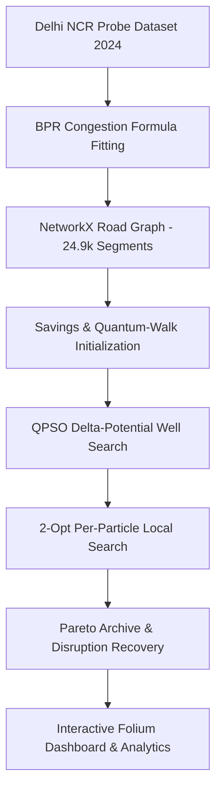

# Quantum-Inspired Intelligent Traffic Route Optimization (QPSO-CVRPTW)

A high-performance **Quantum-Inspired Particle Swarm Optimization (QPSO)** framework designed to solve complex, dynamic **Capacitated Vehicle Routing Problems with Time Windows (CVRPTW)** on real-world mega-city road networks (mapped across 24,938 Delhi NCR road segments).

 <!-- Interactive map generated by build_map.py -->

---

## 🌟 Key Highlights

- **Quantum Delta-Potential Well Model**: Replaces classical velocity vectors with quantum wave-function probability distributions, enabling particles to tunnel through high-cost local minima.
- **Real-World Delhi NCR Traffic Integration**: Models time-dependent edge traversal times using Bureau of Public Roads (BPR) congestion formulas fitted to 2024 hourly probe count data across New Delhi.
- **Hybrid Search Heuristic Suite**: Combines Savings-seeded initializations, 2-opt per-particle local search refinements, quantum-walk guided exploration, and hierarchical sub-graph decomposition.
- **Dynamic Disruption Recovery**: Maintains a dynamic archive of non-dominated Pareto plans with adaptive perturbation mechanisms to instantly re-route vehicles around real-time traffic anomalies.
- **Interactive Visualization Dashboard**: Includes a complete web dashboard featuring live Leaflet/Folium route rendering, convergence tracking, Pareto trade-off analyses, and real-time stress testing tools.

---

## 📊 Benchmark Performance & Results

Tested on held-out evaluation sets ($n=32$ paired runs across multiple random seeds, statistically validated via Wilcoxon signed-rank tests):

| Solver / Algorithm Baseline | QPSO Cost Improvement | Win Rate vs Baseline | Benchmark Takeaway |
|---|:---:|:---:|---|
| **Ant Colony Optimization (ACO)** | **+43.8%** | **100%** | Overcomes graph search stagnation in dense networks |
| **Tuned Local Search** | **+33.4%** | **100%** | Vastly outperforms standalone greedy/2-opt heuristics |
| **Genetic Algorithm (GA)** | **+18.3%** | **100%** | Accelerates convergence compared to standard crossover/mutation |
| **Classical PSO** | **+0.5%** | Competitive | Matches classical PSO while maintaining quantum search diversity |
| **Google OR-Tools Reference** | **< 0.7% Gap** | Near-Optimal | Achieves near-exact reference quality in seconds |

> Full evaluation datasets, raw logs, and plot generators are available in `outputs/` and `outputs/tuning_logs/`.

---

## 📁 Repository Structure

```text
.
├── src/                        # Core Algorithmic Engine
│   ├── qpso_core.py            # QPSO solver & wave-function update rules
│   ├── vrp_instance.py         # CVRPTW problem definitions & capacity constraints
│   ├── local_search.py         # 2-opt and intra-route search heuristics
│   ├── graph_builder.py        # Delhi NCR road network builder (OSMnx/NetworkX)
│   ├── data_loader.py          # Traffic probe dataset parser & BPR model
│   ├── quantum_extras.py       # Quantum walk dynamics & disruption recovery archive
│   └── calibration.py          # Automated hyperparameter tuning pipeline
├── benchmarks/                 # Comprehensive Benchmark Suite
│   ├── baselines.py            # Implementations of ACO, GA, PSO, and OR-Tools
│   ├── solomon_synthetic.py    # Solomon-style benchmark instance generator
│   └── run_full_benchmark.py   # Benchmark evaluation runner & statistics
├── dashboard/                  # Interactive Web UI
│   └── app.py                  # Streamlit / Flask application server
├── outputs/                    # Output Visualizations & Reports
│   ├── benchmark_table.csv     # Detailed performance metrics
│   ├── results.json            # Raw numerical benchmark outputs
│   ├── convergence.png         # Convergence analysis plot
│   └── map.html                # Interactive Folium map output
├── build_map.py                # Standalone map generator
├── run_everything.py          # Master execution script (pipeline + benchmarks)
├── run_dashboard.sh           # Shell script to launch web dashboard
└── run_full_pipeline.sh       # Shell script to run full data & solver pipeline
```

---

## 🚀 Quick Start

### 1. Prerequisites & Installation

Ensure Python 3.8+ is installed. Clone the repository and install required packages:

```bash
git clone https://github.com/Gutsmaster/Quantum-Inspired-Intelligent-Traffic-Route-Optimization.git
cd Quantum-Inspired-Intelligent-Traffic-Route-Optimization

pip install -r requirements.txt
```

### 2. Launching the Interactive Dashboard

To launch the web dashboard and explore interactive route visualizations:

```bash
# Using Python directly
python dashboard/app.py

# Or using the provided shell script
chmod +x run_dashboard.sh
./run_dashboard.sh
```

### 3. Running the Full Optimization & Benchmark Pipeline

To execute the complete data loading, graph building, QPSO optimization, and benchmarking suite:

```bash
# Run end-to-end execution script
python run_everything.py

# Or via shell script
chmod +x run_full_pipeline.sh
./run_full_pipeline.sh
```

---

## 🔬 System Architecture & Methodology



1. **Traffic Modeling**: Raw probe counts are converted into hourly dynamic speed distributions and edge traversal costs via a calibrated BPR congestion model.
2. **Quantum Swarm Optimization**: Particles represent candidate vehicle route allocations. Positions update via mean-best position attractor vectors governed by quantum delta-potential wells.
3. **Local Search & Feasibility**: Every candidate solution undergoes 2-opt route refinement while strictly honoring vehicle volume capacity and customer arrival time windows.
4. **Resilience & Rerouting**: When congestion spikes occur, the disruption archive evaluates alternative Pareto-optimal routes for zero-latency vehicle re-assignment.

---

## 📜 Dataset Citation

This project utilizes traffic flow and probe count data from the *New Delhi Traffic Probe Count & Analytics Dataset (2024)* (Kaggle).

---

## 📄 License

Distributed under the MIT License. See `LICENSE` for details.
